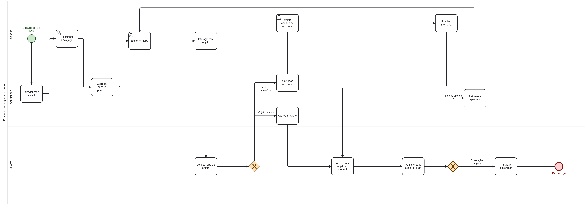

# BPMN

BPMN é a sigla para *Business Process Model and Notation*, um padrão gráfico voltado à modelagem de processos. Segundo a Object Management Group (OMG), a especificação BPMN fornece uma notação gráfica para representar processos de negócio em diagramas, com o objetivo de oferecer uma linguagem padronizada e compreensível tanto para usuários de negócio quanto para usuários técnicos [1].

Um diagrama BPMN serve para representar visualmente o fluxo de atividades, decisões, eventos e responsabilidades envolvidas em um processo. Por utilizar uma notação padronizada, ele facilita a comunicação entre os participantes do projeto, melhora o entendimento do fluxo processual e contribui para a implementação mais precisa das rotinas modeladas [1][2].

No contexto deste projeto, o BPMN é importante porque organiza de forma visual o ciclo principal de interação do jogador com o sistema, evidenciando as ações do usuário, as respostas da aplicação e as validações realizadas pelo sistema. Isso ajuda a reduzir ambiguidades na compreensão do fluxo principal do jogo e oferece uma base mais clara para as próximas etapas de análise, implementação e validação.

A Figura 1 apresenta o diagrama BPMN do projeto **Ani**, modelado conforme a abordagem estudada nas aulas de Engenharia de Software.

## Figura 1 - Diagrama BPMN do projeto Ani

O fluxo representado no diagrama descreve, em nível macro, a jornada principal de exploração do jogador: iniciar o jogo, acessar o cenário principal, interagir com objetos, verificar se o objeto está associado a uma memória, registrar o progresso e decidir entre continuar a exploração ou encerrar a sessão. Essa modelagem é relevante para o projeto porque explicita a lógica central da experiência interativa e evidencia como os elementos de exploração e memória se relacionam dentro da estrutura do sistema.

O arquivo-fonte do diagrama está disponível em [ani.bpmn](./ani.bpmn), e a descrição textual do processo modelado pode ser consultada em [descricao-do-processo.md](./descricao-do-processo.md).

## Referências

[1] OBJECT MANAGEMENT GROUP (OMG). *Business Process Model & Notation (BPMN)*. Disponível em: <https://www.omg.org/bpmn/>. Acesso em: 22 mar. 2026.

[2] LUCID SOFTWARE INC. *BPMN tutorial*. Disponível em: <https://www.lucidchart.com/pages/tutorial/bpmn>. Acesso em: 22 mar. 2026.
