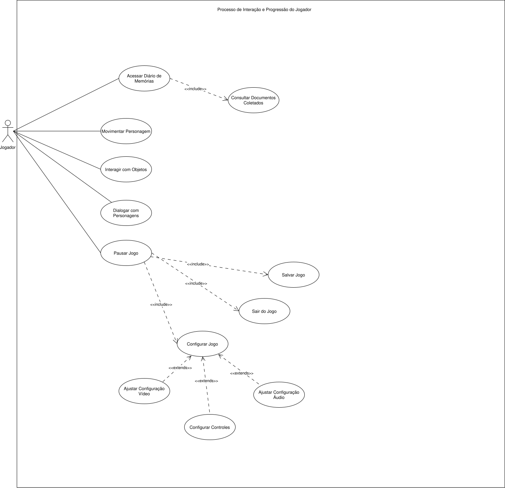

# Caso de Uso

Caso de uso é uma técnica de modelagem utilizada para descrever, sob a perspectiva de atores externos, as interações realizadas com um sistema para atingir determinados objetivos. Em diagramas de caso de uso, essas interações ajudam a representar o comportamento esperado do sistema e suas fronteiras de atuação, sem detalhar sua implementação interna [1][2].

A importância do caso de uso está em apoiar a identificação e a organização dos requisitos funcionais, além de tornar mais clara a relação entre os atores e as principais funcionalidades do sistema. Essa modelagem também contribui para delimitar o escopo do projeto e facilitar a comunicação entre desenvolvimento, orientação e demais envolvidos [1][2].

No projeto **Ani**, os casos de uso são importantes para representar as principais interações entre o jogador e o sistema, como movimentação, interação com objetos, leitura de documentos, acesso ao diário de memórias, salvamento de progresso e configuração da experiência.

A Figura 1 apresenta o diagrama de casos de uso do projeto **Ani**, elaborado conforme o modelo estudado nas aulas de Engenharia de Software.

## Figura 1 - Diagrama de Casos de Uso do projeto Ani

O diagrama evidencia os principais atores envolvidos e as funcionalidades centrais do sistema, contribuindo para a visualização do escopo funcional do projeto e para a organização da documentação de requisitos.

O Quadro 1 apresenta o índice dos casos de uso atualmente documentados no projeto.

## Quadro 1 - Índice de Casos de Uso do projeto Ani

| ID | Caso de Uso Revisado | Ator Primário |
| --- | --- | --- |
| UC-S001 | Movimentar Personagem | Jogador |
| UC-S002 | Interagir com Objetos | Jogador |
| UC-S003 | Dialogar com Personagens | Jogador |
| UC-S004 | Consultar Documentos Coletados | Jogador |
| UC-S005 | Acessar Diário de Memórias | Jogador |
| UC-S006 | Pausar Jogo | Jogador |
| UC-S007 | Configurar Jogo | Jogador |
| UC-S008 | Ajustar Configurações de Vídeo | Jogador |
| UC-S009 | Ajustar Configurações de Áudio | Jogador |
| UC-S010 | Configurar Controles | Jogador |
| UC-S011 | Sair do Jogo | Jogador |
| UC-S012 | Salvar Jogo | Jogador |

O Quadro 2 apresenta, como exemplo, a especificação de um dos casos de uso do projeto.

## Quadro 2 - Especificação de Caso de Uso: Interagir com Objetos

| Campo | Descrição |
| --- | --- |
| Caso de Uso | UC-S002 - Interagir com Objetos |
| ID | UC-S002 |
| Nome revisado | Interagir com Objetos |
| Descrição | Este caso de uso permite que o jogador interaja com objetos significativos para acessar memórias, fragmentos narrativos ou elementos contemplativos do cenário. |
| Ator Primário | Jogador |
| Pré-condição | Ani deve estar próximo de um objeto interativo. |
| Cenário Principal | 1. Jogador pressiona a tecla de interação. 2. Sistema identifica o tipo de objeto interativo. 3. Sistema ativa o conteúdo associado, como memória, fragmento textual, objeto restaurável ou evento contemplativo. 4. Quando aplicável, o conteúdo é registrado no diário de Ani. |
| Pós-condição | O conteúdo associado ao objeto é disponibilizado ao jogador e, quando aplicável, registrado no diário de memórias. |
| Cenários Alternativos | Se o objeto não for interativo, nada acontece. |
| Observações arquiteturais | Mantém relação direta com RF003, RF004, RF015 e RF016. |
| Indicação | Permanecer. |

A documentação completa de casos de uso, incluindo o índice de casos de uso, o diagrama e a especificação de cada caso, pode ser consultada em [caso-de-uso.md](./caso-de-uso.md).

## Referências

[1] IBM. *Creating use-case diagrams*. Disponível em: <https://www.ibm.com/docs/en/dma?topic=diagrams-creating-use-case>. Acesso em: 22 mar. 2026.

[2] IBM. *Use case view*. Disponível em: <https://www.ibm.com/docs/en/systems-engineering/1.5.0?topic=views-use-case-view>. Acesso em: 22 mar. 2026.
