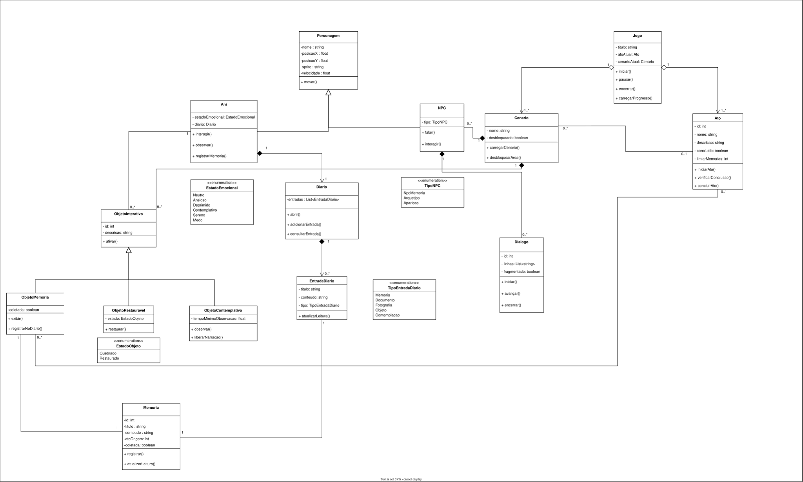

# Diagrama de Classes

O diagrama de classes é um diagrama estrutural da UML utilizado para representar classes, atributos, métodos e relacionamentos entre os elementos de um sistema. Esse tipo de diagrama permite visualizar a estrutura estática da aplicação e como seus componentes se organizam em termos de responsabilidades e associações [1][2].

A importância do diagrama de classes está em apoiar a modelagem da arquitetura do sistema antes e durante a implementação. Ao explicitar classes, operações e vínculos entre objetos, ele facilita o entendimento da solução, orienta a organização do código e contribui para a comunicação técnica entre os envolvidos no projeto [1][2].

No projeto **Ani**, o diagrama de classes é importante porque descreve a base estrutural dos principais elementos do jogo, como o estado geral da sessão, a personagem Ani, NPCs, diálogos, memórias, diário, atos, cenários e objetos interativos. Com isso, o artefato organiza a visão estrutural do sistema de forma coerente com a versão atual do projeto.

A Figura 1 apresenta o diagrama de classes do projeto **Ani**, elaborado conforme o modelo estudado nas aulas de Engenharia de Software.

## Figura 1 - Diagrama de Classes do projeto Ani

O diagrama evidencia os principais componentes estruturais do sistema e as relações entre entidades centrais da experiência jogável, contribuindo para a organização da implementação do projeto.

O Quadro 1 apresenta a estrutura de classes, atributos e métodos modelada para o projeto.

## Quadro 1 - Estrutura de classes do projeto Ani

| Classe | Atributos | Métodos |
| --- | --- | --- |
| Jogo | `titulo : string`, `atoAtual : Ato`, `cenarioAtual : Cenario` | `iniciar()`, `pausar()`, `encerrar()`, `carregarProgresso()` |
| Personagem | `nome : string`, `posicaoX : float`, `posicaoY : float`, `sprite : string`, `velocidade : float` | `mover()` |
| Ani | `estadoEmocional : EstadoEmocional`, `diario : Diario` | `interagir()`, `observar()`, `registrarMemoria()` |
| NPC | `tipo : TipoNPC` | `falar()`, `interagir()` |
| Dialogo | `id : int`, `linhas : List<string>`, `fragmentado : boolean` | `iniciar()`, `avançar()`, `encerrar()` |
| ObjetoInterativo | `id : int`, `descricao : string` | `ativar()` |
| ObjetoMemoria | `coletada : boolean` | `exibir()`, `registrarNoDiario()` |
| Memoria | `id : int`, `titulo : string`, `conteudo : string`, `atoOrigem : int`, `coletada : boolean` | `registrar()`, `atualizarLeitura()` |
| Diario | `entradas : List<EntradaDiario>` | `abrir()`, `adicionarEntrada()`, `consultarEntrada()` |
| EntradaDiario | `titulo : string`, `conteudo : string`, `tipo : TipoEntradaDiario` | `atualizarLeitura()` |
| Cenario | `nome : string`, `desbloqueado : boolean` | `carregarCenario()`, `desbloquearArea()` |
| Ato | `id : int`, `nome : string`, `descricao : string`, `concluido : boolean`, `limiarMemorias : int` | `iniciarAto()`, `verificarConclusao()`, `concluirAto()` |
| ObjetoRestauravel | `estado : EstadoObjeto` | `restaurar()` |
| ObjetoContemplativo | `tempoMinimoObservacao : float` | `observar()`, `liberarNarracao()` |

O Quadro 2 apresenta as enumerações utilizadas para restringir valores recorrentes da modelagem.

## Quadro 2 - Enumerações do projeto Ani

| Enumeração | Valores |
| --- | --- |
| TipoNPC | `NpcMemoria`, `Arquetipo`, `Aparicao` |
| EstadoEmocional | `Neutro`, `Ansioso`, `Deprimido`, `Contemplativo`, `Sereno`, `Medo` |
| TipoEntradaDiario | `Memoria`, `Documento`, `Fotografia`, `Objeto`, `Contemplacao` |
| EstadoObjeto | `Quebrado`, `Restaurado` |

O Quadro 3 sintetiza os principais relacionamentos representados no diagrama.

## Quadro 3 - Relacionamentos entre classes

| Classe Origem | Tipo de Relacionamento | Classe Destino | Multiplicidade |
| --- | --- | --- | --- |
| Jogo | Composição | Ato | `Jogo 1` para `Ato 1..*` |
| Jogo | Composição | Cenario | `Jogo 1` para `Cenario 1..*` |
| Ani | Herança / Generalização | Personagem | Especialização de `Personagem` |
| NPC | Herança / Generalização | Personagem | Especialização de `Personagem` |
| Ani | Composição | Diario | `Ani 1` para `Diario 1` |
| Ani | Associação | ObjetoInterativo | `Ani 1` para `ObjetoInterativo 0..*` |
| NPC | Composição | Dialogo | `NPC 1` para `Dialogo 0..*` |
| Cenario | Composição | NPC | `Cenario 1` para `NPC 0..*` |
| Cenario | Composição | ObjetoInterativo | `Cenario 1` para `ObjetoInterativo 0..*` |
| ObjetoMemoria | Herança / Generalização | ObjetoInterativo | Especialização de `ObjetoInterativo` |
| ObjetoRestauravel | Herança / Generalização | ObjetoInterativo | Especialização de `ObjetoInterativo` |
| ObjetoContemplativo | Herança / Generalização | ObjetoInterativo | Especialização de `ObjetoInterativo` |
| ObjetoMemoria | Associação | Memoria | `ObjetoMemoria 1` para `Memoria 1` |
| Memoria | Associação | EntradaDiario | `Memoria 1` para `EntradaDiario 1` |
| Diario | Composição | EntradaDiario | `Diario 1` para `EntradaDiario 0..*` |
| Ato | Associação | Cenario | `Ato 0..1` para `Cenario 0..*` |

O conjunto dessas classes mostra a separação entre a lógica principal do jogo, a personagem controlada, os elementos narrativos, os objetos de interação e os artefatos de registro da experiência do jogador. Essa organização é relevante para o projeto porque ajuda a distribuir responsabilidades entre os elementos do sistema e favorece uma implementação mais clara, modular e alinhada aos requisitos já definidos.

O arquivo do diagrama pode ser consultado em [diagrama-de-classe.drawio](./diagrama-de-classe.drawio) e sua versão de visualização em [diagrama-de-classe.drawio.svg](./diagrama-de-classe.drawio.svg).

## Referências

[1] IBM. *UML diagrams*. Disponível em: <https://www.ibm.com/docs/en/radfws/9.6.1?topic=diagrams-uml>. Acesso em: 22 mar. 2026.

[2] VISUAL PARADIGM. *What is Class Diagram?* Disponível em: <https://www.visual-paradigm.com/guide/uml-unified-modeling-language/what-is-class-diagram/>. Acesso em: 22 mar. 2026.
